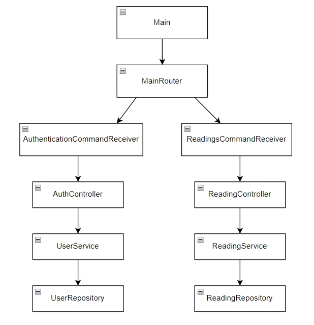

# Monitoring-Service App

---
Консольное приложение для передачи показаний со счетчиков горячей, холодной воды и т.д.
Взаимодействие с приложением происходит через консоль.

---
Стек используемых технологий:
- Java 17
- Lombok
- Logback
- JUnit
- Javadoc

---
Диаграмма главных классов

---
## Локальный запуск

### Требования

Проект использует синтаксис Java 17. Для локального запуска вам потребуется
установленный JDK 17.

### Используя среду разработки IDEA

Откройте проект. Дождитесь индексации. Запустите main метод класса [src/main/java/org/example/monitoringservice/Main.java](src/main/java/org/example/monitoringservice/Main.java)

---
После запуска приложения можно работать с программой из консоли посредством следующих команд:
- REGISTER - зарегистрировать аккаунт, после ввода команды программа ожидает ввода email и роли пользователя;
- LOGIN - выполнение входа в личный кабинет, после ввода команды программа ожидает ввода адреса электронной почты;
- AUTHORITY - получение информации о полномочиях пользователя на сайте в зависимости от присвоенной роли;
- LOGOUT - выход из личного кабинета;
- SEND - передача показаний счетчика, после ввода команды программа ожидает ввода наименования типа передаваемого показания и значения показания. Для подачи следующего показания необходимо повторно ввести команду SEND;
- ADD - добавление нового типа показания, после ввода команды программа ожидает ввода типа показаний;
- ACTUAL - вывод всех актуальных показаний;
- MONTH - вывод показаний за конкретный месяц, после ввода команды программа ожидает ввода месяца;
- HISTORY - вывод истории подачи показаний;
- HELP - вывод списка возможных команд

---
Приложение логирует действия пользователя с записью логов в файл. Файл сохраняется в папку logs в корне проекта.