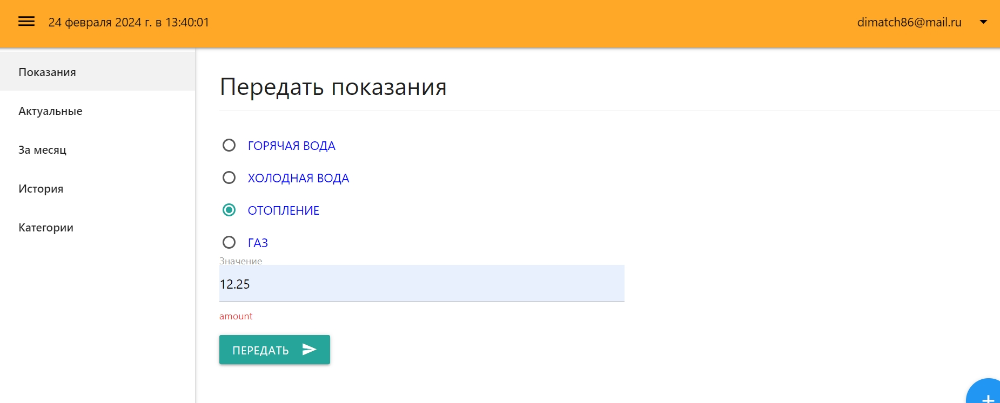

# Monitoring-Service App

---
Приложение для передачи показаний со счетчиков горячей, холодной воды и т.д.
Взаимодействие с приложением происходит через Http клиент, например Postman, Swagger-UI или веб-интерфейс.



---
Стек используемых технологий:
- Java 17
- Spring Boot 3.2.0
- Spring Security
- JDBC
- PostgreSQL
- Liquibase
- Mapstruct
- AOP
- Lombok
- Logback
- Testcontainers
- Mockito
- Javadoc
- Swagger-UI


---
## Локальный запуск

### Требования

Проект использует синтаксис Java 17. Для локального запуска вам потребуется 
Docker Desktop для запуска контейнера с базой данных Postgres.

---
### Запуск приложения в среде разработки

В корне проекта находится файл docker-compose.yml c контейнерами базы данных PostgreSQL, а также фронтенд-составляющей проекта.
Откройте файл docker-compose в среде разработки и нажмите на значок запуска напротив строки "services",
или в командной строке перейдите в папку с проектом и запустите командой:

```bash
docker-compose up -d
```

После этого запускаем приложение из класса [src/main/java/org/example/monitoringservice/MonitoringApplication.java](src/main/java/org/example/monitoringservice/MonitoringApplication.java).
После запуска бэкенд будет доступен на порту http://localhost:8085. Фронтенд будет доступен на http://localhost:8081

---
В корне проекта в папке rest-examples находится файл с коллекцией запросов, которую можно импортировать в Postman.
Описание запросов:
- http://localhost:8085/monitoring-service/auth/register - зарегистрировать аккаунт, POST - запрос, содержит тело запроса;
- http://localhost:8085/monitoring-service/auth/login - выполнение входа в личный кабинет, POST - запрос, содержит тело запроса;
- http://localhost:8085/monitoring-service/auth/info - получение информации о пользователе;
- http://localhost:8085/monitoring-service/auth/logout - выход из личного кабинета;
- http://localhost:8085/monitoring-service/reading/send - передача показаний счетчика;
- http://localhost:8085/monitoring-service/reading/add - добавление нового типа показания;
- http://localhost:8085/monitoring-service/reading/actual - вывод всех актуальных показаний, GET-запрос;
- http://localhost:8085/monitoring-service/reading/month?monthNum=2 - вывод показаний за конкретный месяц GET-запрос, содержит обязательный параметр;
- http://localhost:8085/monitoring-service/reading/history - вывод истории подачи показаний;

---

## Стартеры

---
Приложение содержит отдельные модули кастомных стартеров для логирования времени выполнения методов сервисов и для аудита действий пользователей.
Для активации стартеров необходимо выполнить их публикацию в локальный репозиторий maven. Это можно сделать перейдя во вкладку `gradle` и выполнив команду `publishToMavenLocal` для каждого стартера.
Стартер логирования запускается автоматически вместе с запуском приложения. Стартер аудита подключается в зависимости от значения свойства `audit.enabled` `true` или `false` в файле [application.yml](src/main/resources/application.yml) 

## Swagger

---

При запущенном приложении вы можете просмотреть описание API, а также
выполнять запросы используя интерфейс Swagger.

http://localhost:8085/swagger-ui/index.html